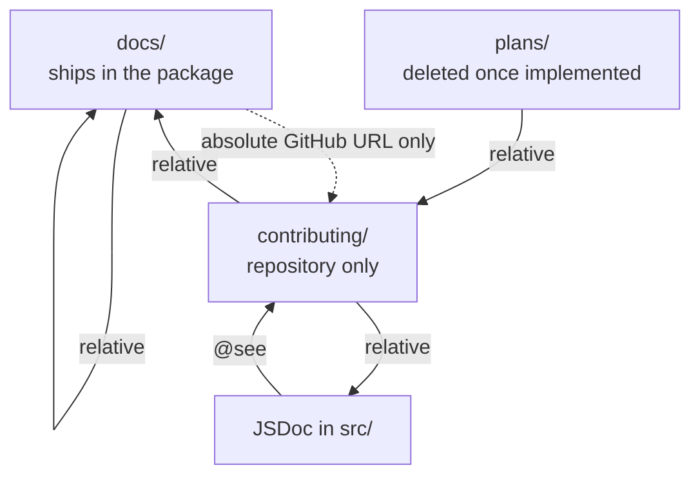

# Documentation

How to write documentation in this repository. Core documents on four surfaces and each has a different reader, so the same sentence can belong on one and be noise on another. Read this before writing or editing any doc, JSDoc included.

Everything a machine can check is checked, in [`src/test/documentation.ts`](../src/test/documentation.ts) and in oxlint's jsdoc plugin. This doc carries the half that cannot be checked, so keep it in your head while writing. What the tools already catch is listed at the end.

## The four surfaces

| Surface | Reader | Answers | Ships |
| --- | --- | --- | --- |
| `docs/` | a developer or agent using the published package | what you can do and how | yes, in the npm package |
| `contributing/` | someone about to change this area of Core | why it is built this way and what must hold | no |
| JSDoc in `src/` | on exports, the consumer through their editor. On internals, the next contributor | what the type signature cannot say | exports do, through the `.d.ts` |
| `plans/` | whoever picks the work up next, often an agent | what still has to happen | no, but it reaches `main` |

Who may link to whom follows from what ships:



## What every surface follows

One test decides whether a sentence belongs anywhere: does the reader learn something the code, the types or the file tree do not already tell them? If not, delete it. A sentence that would read the same in another project's docs says nothing about this one.

Then keep it short and scannable, because nobody reads a wall of text and an agent parses a list faster than a paragraph:

- Reach for a table, a list or a mermaid diagram before a paragraph. Relations and flows belong in a diagram, not in prose describing one. Quote any diagram label holding a special character, so `|"@see"|` rather than `|@see|`.
- One idea per sentence. Name the actor rather than writing passively.
- Plain words. No filler, no marketing, no metaphors standing in for a concrete noun.
- Sentence case headings, straight quotes, no em dashes and no semicolons in prose.
- Present tense. No word that dates the sentence, because docs ship versioned with the code.

## docs/

Write for someone holding the published package with no `src`, no network and no knowledge of Core's internals. Assume they know TypeScript. Answer what they can do and how, never why it was built this way, and keep opinions out.

`docs/` ships without the rest of the repository, so a relative link out of it dangles for its real reader. Point at the repository with an absolute `https://github.com/elek-io/core/blob/main/` URL instead, and let the link text show it leaves the package.

Every page is listed in [`../docs/index.md`](../docs/index.md), and every example pastes and runs, imports included.

```markdown
# Page title

One paragraph saying what this page covers and who needs it.

## First topic

Prose, a table or a list. Examples in `typescript` fences.

## See also

- [`other.md`](./other.md) - what the reader finds there
```

Bad, because a consumer cannot act on it and the phrasing sells rather than states:

```text
Core provides a powerful and seamless Asset pipeline that ensures your
files are always handled correctly.
```

Good, because it names the call, the shape and the failure:

```text
core.assets.create() writes two files, the Asset itself and its .json
metadata. It throws CoreError of type BadRequest for an unsupported
file type.
```

## contributing/

Write for someone about to change this area who can read the source. That makes the source itself off limits as subject matter. What belongs here is what the code cannot hold:

1. The decision, and the alternatives that were rejected with the reason.
2. The invariants, and what breaks when one is violated.
3. The trigger, meaning what a contributor has to read this before doing.

Opinions belong here. A contributing doc that refuses to take a side leaves the next contributor to rediscover the argument.

Contributing docs may link anywhere. Every page is listed in [`index.md`](./index.md).

```markdown
# Page title

One paragraph saying what this covers, and pointing at the consumer doc for the same area.

## The decision

What was chosen, against what, and why.

## Invariants

What has to stay true, and what breaks otherwise.

## See also

- [`../docs/other.md`](../docs/other.md) - the consumer facing behavior
```

## JSDoc in src/

A JSDoc block on an exported symbol reaches the consumer through the `.d.ts` tooltip, so it is consumer documentation written in a different syntax. A block on an internal symbol is contributor documentation. Same rules as the folder that matches the reader.

Say what the type signature cannot say:

- Preconditions, and what the call throws.
- Side effects on disk, on git, or on the remote.
- Whether calling it twice is safe.

Never restate a type, a parameter name or a default. A `@param` that repeats the parameter name is noise, so drop it rather than pad it. When a block outgrows its cap, the reasoning belongs in a `contributing/` doc with a one line `@see` left in the source. No diagrams here, they belong in markdown.

```typescript
/**
 * Ensures a provisioned copy exists at the given ref, provisioning it from
 * the remote when needed. Idempotent, meant to run before every build.
 *
 * Throws `PreconditionFailed` when the copy is mutated, it consumes content
 * rather than editing it.
 *
 * @see ../../docs/provisioning.md
 */
```

## plans/

A plan is work that still has to happen, kept out of `contributing/` so nobody mistakes it for how Core behaves. It can be an idea written down before it vanishes or a brief for work already scoped, and it may be captured on a branch that has nothing to do with its subject.

Plans are committed and reach `main`, so an idea survives until someone picks it up. Delete a plan once its work is implemented or dropped, folding anything durable into a real doc first. List every plan in `plans/index.md`, which is what keeps an old idea findable.

Only the correctness rules read a plan:

- Its links and anchors resolve, and every source path it cites exists.
- Its mermaid diagrams parse.
- It carries no em dashes and no curly quotes.
- It appears in `plans/index.md`.

The shape and brevity rules are yours to keep here rather than the suite's to enforce, so writing an idea down stays cheap. Nothing in `docs/` or `contributing/` links into a plan, because the target disappears.

## What the tools enforce

Run `pnpm test` and `pnpm lint`. Neither list below needs remembering, they are here so a failure message makes sense.

| Rule | Fails when |
| --- | --- |
| `structure/*` | a doc is missing from its index, its H1, its lead paragraph or its `## See also` |
| `links/*` | a link, anchor, cited source path or `@see` does not resolve, `docs/` links out relatively, or anything links into `plans/` |
| `prose/*` | em dashes, curly quotes, title case headings, an unknown fence language, a blocked word or phrase, a `**Label:**` list, or a word that dates a consumer doc |
| `brevity/*` | a paragraph passes 400 characters, four paragraphs run in a row, a section passes 45 content lines, or a JSDoc block passes 12 lines |
| `jsdoc/*` | JSDoc uses a tag outside the agreed set, or a `@todo` carries no issue URL |
| `diagrams/mermaid` | a mermaid diagram does not parse, checked with mermaid's own parser |
| oxlint `jsdoc/*` | a tag is malformed, empty, or restates a type or default |

A file written before a rule existed is exempted in `src/documentation-baseline.json`. It is committed, so a clone and CI judge the same files and the diff shows the list shrinking. It may only shrink, and the suite fails when an entry stops being needed, so an exemption cannot quietly become permanent.

## See also

- [`index.md`](./index.md) - every contributor doc, and what each covers
- [`../docs/index.md`](../docs/index.md) - every consumer doc, and what each covers
- [`naming.md`](./naming.md) - how the things you document are named
- [`linting.md`](./linting.md) - the oxlint layers, including the jsdoc rules left off on purpose
- [`testing.md`](./testing.md) - how the suite that enforces these rules runs
